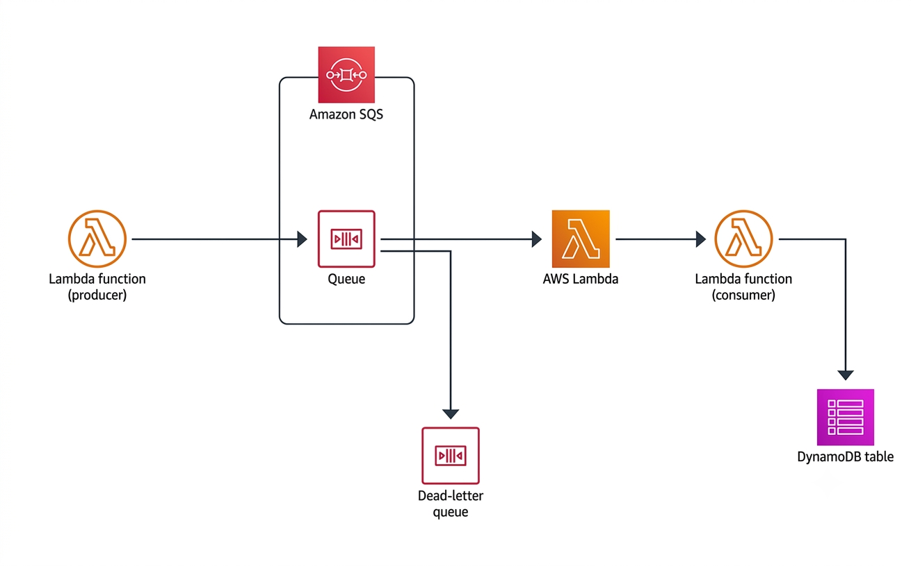

# saa-producer-consumer-sqs

Aplicación SAM - 
**Patrón:** Producer Lambda | SQS | Consumer Lambda | DynamoDB

## Arquitectura




## Estructura del proyecto

```
saa-producer-consumer-sqs/
├── template.yaml          # Infraestructura SAM (IaC)
├── samconfig.toml         # Configuración de deploy
├── .gitignore
├── events/
│   └── sqs-event.json     # Evento de prueba local
└── src/
    ├── producer/
    │   └── app.py         # Lambda que publica en SQS
    └── consumer/
        └── app.py         # Lambda que lee SQS y escribe en DynamoDB
```

## Comandos

### Build
```bash
sam build
```

### Test local - Consumer (requiere Docker)
```bash
sam local invoke ConsumerFunction --event events/sqs-event.json
```

### Deploy
```bash
sam deploy
```

> El `samconfig.toml` ya tiene todos los parámetros configurados. No es necesario `--guided`.

### Invocar Producer manualmente desde AWS CLI

El Producer acepta `coder_id`, `spot_id` y `timestamp` desde el evento. Si no se pasan, usa valores default (`123`, `321`, timestamp actual).

```bash
aws lambda invoke \
  --function-name ProducerFunction \
  --region us-east-1 \
  --payload '{"coder_id": "456", "spot_id": "789"}' \
  --cli-binary-format raw-in-base64-out \
  response.json && cat response.json
```

Sin parámetros (usa defaults):
```bash
aws lambda invoke \
  --function-name ProducerFunction \
  --region us-east-1 \
  --payload '{}' \
  --cli-binary-format raw-in-base64-out \
  response.json
```

### Ver logs en CloudWatch

```bash
sam logs --stack-name saa-producer-consumer-sqs --name ConsumerFunction --tail
sam logs --stack-name saa-producer-consumer-sqs --name ProducerFunction --tail
```

### Sondear la cola SQS

Primero obtenés el URL del Output del stack:
```bash
aws cloudformation describe-stacks \
  --stack-name saa-producer-consumer-sqs \
  --query "Stacks[0].Outputs" \
  --region us-east-1
```

Luego usás el valor de `QueueUrl`:
```bash
aws sqs receive-message \
  --queue-url <QueueUrl> \
  --max-number-of-messages 10 \
  --region us-east-1
```

Cantidad de mensajes sin consumir:
```bash
aws sqs get-queue-attributes \
  --queue-url <QueueUrl> \
  --attribute-names ApproximateNumberOfMessages ApproximateNumberOfMessagesNotVisible \
  --region us-east-1
```

### Ver mensajes en la DLQ

```bash
aws sqs receive-message \
  --queue-url <DLQUrl> \
  --max-number-of-messages 10 \
  --region us-east-1
```

### Consultar DynamoDB

```bash
aws dynamodb scan \
  --table-name checkinData \
  --region us-east-1
```

### Eliminar stack

```bash
sam delete --stack-name saa-producer-consumer-sqs --region us-east-1
```

## Modelo DynamoDB - checkinData

| Atributo   | Tipo | Rol           |
|------------|------|---------------|
| coderId    | S    | Partition Key |
| timestamp  | N    | Sort Key      |
| spotID     | S    | Atributo      |

## Notas

- El Producer usa la variable de entorno `QUEUE_URL` (inyectada por SAM desde `!Ref MyMessageQueue`)
- La DLQ captura mensajes que fallaron 3 veces (`maxReceiveCount: 3`)
- El Consumer usa `ReportBatchItemFailures` para procesar batches parciales sin perder mensajes válidos
- BillingMode DynamoDB: `PAY_PER_REQUEST` (on-demand, ideal para labs)
- Runtime: `python3.13`
- El flag `--cli-binary-format raw-in-base64-out` es requerido en Windows con Git Bash
